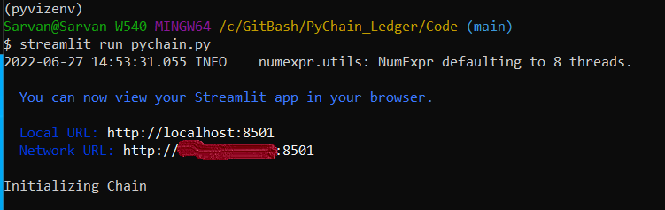

# PyChain Ledger


I am a fintech engineer who’s working at one of the five largest banks in the world. I am promoted to act as the lead developer on their decentralized finance team. My task is to build a blockchain-based ledger system, complete with a user-friendly web interface. This ledger should allow partner banks to conduct financial transactions (that is, to transfer money between senders and receivers) and to verify the integrity of the data in the ledger.

I was provided with a templaye python file with the basic `PyChain` ledger structure codes. I will have to make the following changes to make it better:

1. Create a new data class named `Record`. This class will serve as the blueprint for the financial transaction records that the blocks of the ledger will store.
2. Modify the existing `Block` data class to store `Record` data.
3. Add Relevant User Inputs to the Streamlit interface.
4. Test the PyChain Ledger by Storing Records.

---
## Files

The code file:

[Pychain - Blockchain](Code/pychain.py)

---

## Pychain - Streamlit Interface

I have tested my complete `PyChain` ledger and user interface using Streamlit framework application. I have stored some mined blocks in my PyChain ledger. 
I have completed the following tasks to test the blockchain validation process using my `PyChain` ledger.

- Using the bitbash terminal:- 
    1. navigate to the project folder where I coded this assignment
    2. run the Streamlit application using following streamlit command: `streamlit run pychain.py`
        This invoked a webpage

- Using the webpage, 
    1. Enter values for the sender, receiver, and amount, and then click the Add Block button
        Do this several times to store several blocks in the ledger
    2. Verify the block contents and hashes in the Streamlit dropdown menu
    3. Test the blockchain validation process by using the web interface


## Steps completed

#### Step 1: Created the new data class named Record
```
@dataclass  
class Record:  
    sender: str  
    receiver: str  
    amount: float  
```

#### Step 2: Added variable `record` and set to type `Record`
```
record: Record  
```

#### Step 3: Coded Streamlit user interface
```
    sender = st.text_input("Sender Info")
    receiver = st.text_input("Receiver Info")
    amount = st.text_input("Amount")
```

#### Step4: Testing of the application

* Activating the application


* Application on web page


* Adding data


* Block inspector


* Validating blocks


